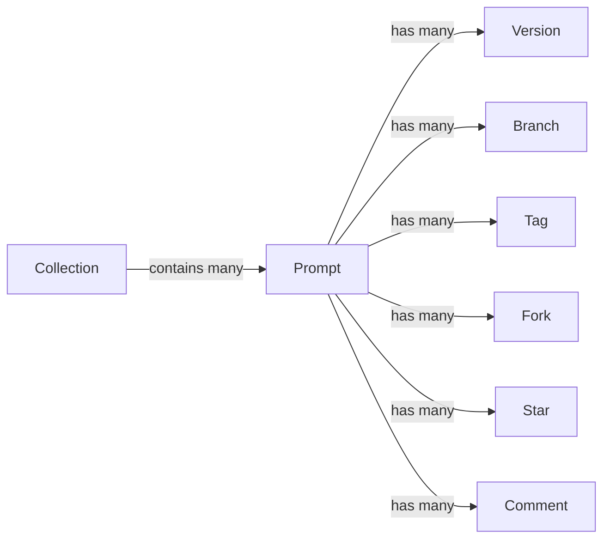
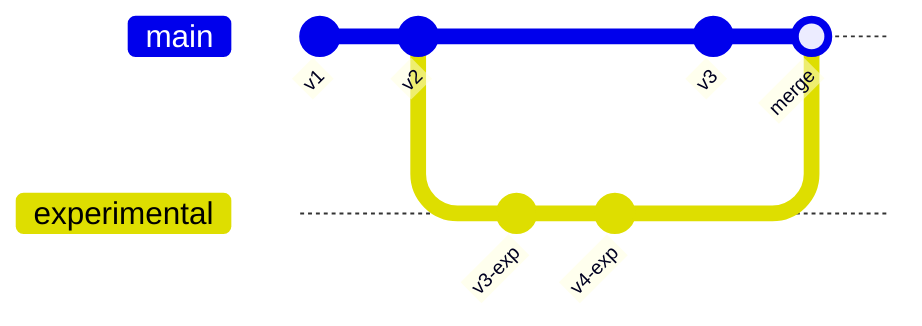
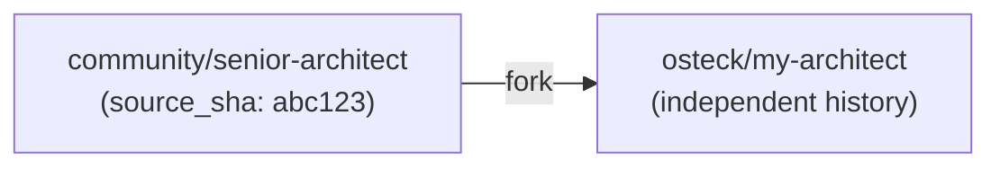

# Cantica API — Developer Manual

> **Base URL:** `http://localhost:8042`  
> **API prefix:** `/v1`  
> **Interactive docs:** [`/docs`](http://localhost:8042/docs) (Swagger UI) · [`/redoc`](http://localhost:8042/redoc) (ReDoc)

---

## Table of contents

1. [Core concepts](#1-core-concepts)
2. [Data models](#2-data-models)
3. [Authentication](#3-authentication)
4. [Meta endpoints](#4-meta-endpoints)
5. [Prompts](#5-prompts)
6. [Versions](#6-versions)
7. [Branches](#7-branches)
8. [Tags](#8-tags)
9. [Forks](#9-forks)
10. [Diff](#10-diff)
11. [Stars](#11-stars)
12. [Comments](#12-comments)
13. [Collections](#13-collections)
14. [Render](#14-render)
15. [Resolve](#15-resolve)
16. [Webhooks](#16-webhooks)
17. [Auth tokens](#17-auth-tokens)
18. [Error reference](#18-error-reference)
19. [Swagger UI guide](#19-swagger-ui-guide)

---

## 1. Core concepts

### Prompt

A **Prompt** is the primary object in Cantica. It is not merely raw text — it is a rich, structured artifact with metadata, variables, visibility, and a full version history.

A prompt is uniquely identified by its **slug**: `{namespace}/{name}`, for example `osteck/code-reviewer`.



### Namespace

A **Namespace** is the owner prefix in a slug. It mirrors GitHub's `owner/repo` model:

- `osteck/architect` — a personal prompt owned by user `osteck`
- `my-org/review-team` — an organisational prompt
- `community/senior-architect` — a curated public prompt

Namespaces are implicit: any `namespace` string used in a prompt's `namespace` field becomes a namespace automatically.

### Version

Every time you save a prompt's content, a **Version** is created. Versions are immutable commits in a git-style object store:

- Each version has a unique **SHA** — a `sha256` hash derived from the content, parent SHA, author, message, and timestamp
- Versions form a **linked list** via `parent_sha`, making history fully traversable
- Content is stored separately in a **content-addressable BlobStore** (deduplicated by hash), with only `content_sha` stored in the database

```
main:  v1 ──► v2 ──► v3 (HEAD)
               │
               └──► v4 ──► v5 (HEAD of "experimental")
```

A version can be addressed by:
- `latest` — the most recent commit on `main`
- `v1.3` — a named tag pointing to a specific SHA
- `abc123f` — a specific commit SHA (full or abbreviated)
- `experimental` — the HEAD of a named branch

### Branch

A **Branch** is a named pointer to the `HEAD` of a chain of versions. This mirrors git branches. Every prompt starts with a `main` branch. You can:

- Create a branch from any SHA
- Commit new versions onto any branch
- Merge one branch into another
- Roll back a branch to any earlier ref

Branch heads advance automatically when new versions are committed to them. Branches are prompt-scoped (each prompt has its own set of branches).

### Tag

A **Tag** is a named, immutable pointer to a specific version SHA. Tags are used for stable releases:

- `v1.0`, `v2.3.1`, `production`, `stable` — any string is valid
- Unlike branches, tags never move
- A tag can be used anywhere a ref is accepted

### Fork

A **Fork** copies an entire prompt (with its content at a specific branch HEAD) into a new `namespace/name` slug. Fork lineage is tracked:

```
community/senior-architect  ──fork──►  osteck/my-architect
         (source_sha recorded)
```

- The fork records `source_slug` and `source_sha` at the time of forking
- The fork becomes an independent prompt with its own version history
- Cantica tracks all forks of a prompt via `fork_count` on the source

### Collection

A **Collection** is a curated, named set of prompts — like a playlist. Collections are also namespaced (`osteck/my-toolkit`), contain any number of prompt slugs, and can be used to group related prompts for a project, team, or theme.

Collections do not version-control membership — they are mutable sets. To version a collection, commit a new version of a dedicated prompt describing the set.

### Diff

A **Diff** computes the line-by-line difference between any two versions of a prompt, addressed by any valid ref. The diff is returned as a unified diff string (the same format as `git diff`).

### Render

**Render** fills in a prompt's `{{variable}}` placeholders with supplied values, falls back to defaults declared in the prompt's variable schema, and returns the final content string ready to send to a model. Required variables that are missing raise a 422 error.

Variable syntax: `{{variable_name}}` within the content string.

### URI resolution

Prompts can be referenced by a `cantica://` URI — the scheme used by songbook agents and the CLI:

```
cantica://osteck/code-reviewer@v1.3
cantica://community/senior-architect@latest
cantica://osteck/my-prompt@abc123f
```

The `/v1/resolve` endpoint parses this URI and returns the resolved `Version`. An optional `remote_url` allows resolving against a remote Cantica instance (federation).

### Webhook

A **Webhook** is an HTTP callback registered for a list of events. When a matching event fires, Cantica sends a signed POST request to the configured URL with the event payload.

Supported events:
- `version.created` — a new version was committed

The request is signed using HMAC-SHA256 with the `secret` you provide, delivered in the `X-Cantica-Signature` header.

---

## 2. Data models

### Prompt

| Field | Type | Description |
|---|---|---|
| `id` | `string (UUID)` | Unique identifier |
| `namespace` | `string` | Owner namespace |
| `name` | `string` | Prompt name (unique within namespace) |
| `slug` | `string` | Computed: `namespace/name` |
| `description` | `string` | Short human-readable description |
| `tags` | `string[]` | Searchable labels |
| `model_hints` | `string[]` | Suggested model identifiers (e.g. `gpt-4o`) |
| `license` | `string` | SPDX identifier, default `MIT` |
| `visibility` | `enum` | `public` · `private` · `unlisted` · `team` |
| `variables` | `VariableSchema[]` | Declared template variables |
| `star_count` | `integer` | Cached count of stars |
| `fork_count` | `integer` | Cached count of forks |
| `default_branch` | `string` | Default branch name, usually `main` |
| `created_at` | `datetime` | ISO 8601 UTC |
| `updated_at` | `datetime` | ISO 8601 UTC |

### Version

| Field | Type | Description |
|---|---|---|
| `sha` | `string` | Unique commit SHA (sha256 hex) |
| `prompt_id` | `string (UUID)` | Parent prompt |
| `branch` | `string` | Branch this version lives on |
| `parent_sha` | `string \| null` | Previous version SHA (null for root) |
| `message` | `string` | Commit message |
| `author` | `string` | Author identifier |
| `content` | `string` | Full prompt text |
| `variables` | `VariableSchema[]` | Variable schema snapshot at this version |
| `tags` | `string[]` | Tag names pointing to this SHA |
| `created_at` | `datetime` | ISO 8601 UTC |

### Branch

| Field | Type | Description |
|---|---|---|
| `name` | `string` | Branch name |
| `prompt_id` | `string (UUID)` | Owning prompt |
| `head_sha` | `string` | SHA of the current HEAD |
| `created_at` | `datetime` | ISO 8601 UTC |
| `updated_at` | `datetime` | ISO 8601 UTC |

### Tag

| Field | Type | Description |
|---|---|---|
| `name` | `string` | Tag name (e.g. `v1.0`) |
| `prompt_id` | `string (UUID)` | Owning prompt |
| `sha` | `string` | Version SHA this tag points to |
| `created_at` | `datetime` | ISO 8601 UTC |

### Fork

| Field | Type | Description |
|---|---|---|
| `id` | `string (UUID)` | Unique identifier |
| `source_slug` | `string` | `namespace/name` of the source prompt |
| `source_sha` | `string` | SHA at time of forking |
| `fork_slug` | `string` | `namespace/name` of the new fork |
| `created_at` | `datetime` | ISO 8601 UTC |

### Collection

| Field | Type | Description |
|---|---|---|
| `id` | `string (UUID)` | Unique identifier |
| `namespace` | `string` | Owner namespace |
| `name` | `string` | Collection name |
| `description` | `string` | Human-readable description |
| `created_at` | `datetime` | ISO 8601 UTC |

### VariableSchema

| Field | Type | Description |
|---|---|---|
| `name` | `string` | Variable name (used in `{{name}}`) |
| `type` | `string` | `string` (only type currently supported) |
| `description` | `string` | Human-readable hint |
| `default` | `any \| null` | Default value (used when not supplied at render time) |
| `required` | `boolean` | If true, render fails without a value or default |

### Visibility

| Value | Description |
|---|---|
| `public` | Visible to everyone |
| `private` | Visible only to owner |
| `unlisted` | Accessible by direct link but not listed |
| `team` | Visible within the owner's organisation |

---

## 3. Authentication

Authentication is **opt-in**. It is disabled by default and can be enabled with `CANTICA_AUTH_ENABLED=true`.

### When auth is disabled

Every request is treated as the `local` user. No headers are required.

### When auth is enabled

Pass a raw API key in the `X-API-Key` header:

```
X-API-Key: cntk_xxxxxxxxxxxxxxxxxxxx
```

The raw key is shown **exactly once** at creation time ([`POST /v1/tokens`](#post-v1tokens)). Only the SHA-256 hash of the key is stored. If lost, revoke and re-create.

### Swagger UI authentication

1. Open [`/docs`](http://localhost:8042/docs)
2. Click the **Authorize** button (🔒) at the top right
3. Enter your API key in the `X-API-Key` field
4. Click **Authorize** — all subsequent requests from the UI will include the header

---

## 4. Meta endpoints

### `GET /health`

Health check. Returns `200 OK` if the server is running.

**Response `200`**
```json
{ "status": "ok" }
```

---

### `GET /.well-known/cantica.json`

Service discovery document. Used by clients and federation partners to locate the API.

**Response `200`**
```json
{
  "version": "0.1",
  "api_url": "/v1",
  "webhooks_url": "/v1/hooks"
}
```

---

## 5. Prompts

Prompts are the top-level objects. A prompt holds metadata and owns a version history.

---

### `GET /v1/prompts`

List or search prompts. Returns all prompts when called with no parameters, or applies filters.

**Query parameters**

| Parameter | Type | Description |
|---|---|---|
| `namespace` | `string` | Filter by namespace |
| `q` | `string` | Full-text search query (searches name, description, content) |
| `tag` | `string` | Filter to prompts that include this tag |
| `model` | `string` | Filter to prompts that list this model hint |
| `visibility` | `string` | Filter by visibility (`public`, `private`, `unlisted`, `team`) |

**Response `200`** — `PromptResponse[]`

```json
[
  {
    "id": "3fa85f64-5717-4562-b3fc-2c963f66afa6",
    "namespace": "osteck",
    "name": "code-reviewer",
    "slug": "osteck/code-reviewer",
    "description": "Reviews code for correctness and style",
    "tags": ["engineering", "review"],
    "model_hints": ["gpt-4o", "claude-opus-4"],
    "license": "MIT",
    "visibility": "public",
    "variables": [],
    "star_count": 12,
    "fork_count": 3,
    "default_branch": "main",
    "created_at": "2026-05-24T10:00:00Z",
    "updated_at": "2026-05-24T11:30:00Z"
  }
]
```

---

### `POST /v1/prompts`

Create a new prompt. The `namespace/name` combination must be unique.

**Request body**

```json
{
  "namespace": "osteck",
  "name": "code-reviewer",
  "description": "Reviews code for correctness and style",
  "tags": ["engineering", "review"],
  "model_hints": ["gpt-4o"],
  "license": "MIT",
  "visibility": "public",
  "variables": [
    {
      "name": "language",
      "type": "string",
      "description": "Programming language to review",
      "default": "Python",
      "required": false
    }
  ]
}
```

| Field | Required | Default |
|---|---|---|
| `namespace` | ✅ | — |
| `name` | ✅ | — |
| `description` | ❌ | `""` |
| `tags` | ❌ | `[]` |
| `model_hints` | ❌ | `[]` |
| `license` | ❌ | `"MIT"` |
| `visibility` | ❌ | `"public"` |
| `variables` | ❌ | `[]` |

**Response `201`** — `PromptResponse`  
**Response `409`** — Prompt already exists

---

### `GET /v1/prompts/{namespace}/{name}`

Retrieve a single prompt by its slug.

**Path parameters**

| Parameter | Description |
|---|---|
| `namespace` | Owner namespace |
| `name` | Prompt name |

**Response `200`** — `PromptResponse`  
**Response `404`** — Prompt not found

---

### `DELETE /v1/prompts/{namespace}/{name}`

Permanently delete a prompt and all its versions, branches, tags, stars, comments, and forks.

**Response `204`** — Deleted  
**Response `404`** — Prompt not found

---

## 6. Versions

Versions are the immutable commits of a prompt's content. Each commit advances the HEAD of its branch.

---

### `GET /v1/prompts/{namespace}/{name}/versions`

List the commit history for a prompt on a given branch (newest first).

**Query parameters**

| Parameter | Type | Default | Description |
|---|---|---|---|
| `branch` | `string` | `main` | Branch to read history from |

**Response `200`** — `VersionResponse[]`

```json
[
  {
    "sha": "a3f1d2e4...",
    "prompt_id": "3fa85f64-...",
    "branch": "main",
    "parent_sha": "b1c2d3e4...",
    "message": "tighten instructions for edge cases",
    "author": "osteck",
    "content": "You are a code reviewer...",
    "variables": [],
    "tags": ["v1.1"],
    "created_at": "2026-05-24T11:00:00Z"
  }
]
```

---

### `POST /v1/prompts/{namespace}/{name}/versions`

Commit a new version of the prompt. Advances the branch HEAD.

**Request body**

```json
{
  "content": "You are a senior code reviewer specialising in {{language}}.",
  "message": "add language variable",
  "author": "osteck",
  "branch": "main",
  "variables": [
    {
      "name": "language",
      "type": "string",
      "default": "Python",
      "required": false
    }
  ]
}
```

| Field | Required | Default | Notes |
|---|---|---|---|
| `content` | ✅ | — | Full prompt text |
| `message` | ✅ | — | Commit message |
| `author` | ✅ | — | Author identifier |
| `branch` | ❌ | `"main"` | Target branch |
| `variables` | ❌ | `[]` | Updated variable schema |
| `sha` | ❌ | — | **Import mode** — preserve SHA across instances |
| `parent_sha` | ❌ | — | **Import mode** — explicit parent |
| `created_at` | ❌ | — | **Import mode** — preserve original timestamp |

> **Import mode:** When `sha`, `parent_sha`, and `created_at` are all provided, the server calls `import_version()` instead of `commit()`, preserving the exact SHA. Useful for migrating prompts between Cantica instances without rewriting history. Returns `409` if the SHA already exists.

**Response `201`** — `VersionResponse`  
**Response `404`** — Prompt not found  
**Response `409`** — SHA conflict (import mode only)

---

### `GET /v1/prompts/{namespace}/{name}/versions/{ref}`

Retrieve a specific version by ref. A ref can be:

| Ref format | Example | Resolves to |
|---|---|---|
| Branch name | `main`, `experimental` | HEAD of that branch |
| Tag name | `v1.0`, `stable` | Version the tag points to |
| Full SHA | `a3f1d2e4c5...` | Exact version |
| Abbreviated SHA | `a3f1d2` | Version with matching SHA prefix |
| `latest` | `latest` | HEAD of `main` |

**Response `200`** — `VersionResponse`  
**Response `404`** — Ref not found

---

## 7. Branches

Branches are named pointers to version HEADs, scoped per prompt.



---

### `GET /v1/prompts/{namespace}/{name}/branches`

List all branches for a prompt.

**Response `200`** — `BranchResponse[]`

```json
[
  {
    "name": "main",
    "prompt_id": "3fa85f64-...",
    "head_sha": "a3f1d2e4...",
    "created_at": "2026-05-24T10:00:00Z",
    "updated_at": "2026-05-24T12:00:00Z"
  }
]
```

---

### `POST /v1/prompts/{namespace}/{name}/branches`

Create a new branch starting from a specific commit SHA.

**Request body**

```json
{
  "name": "experimental",
  "from_sha": "a3f1d2e4c5b6..."
}
```

| Field | Required | Description |
|---|---|---|
| `name` | ✅ | New branch name |
| `from_sha` | ✅ | SHA to branch from |

**Response `201`** — `BranchResponse`  
**Response `404`** — Prompt or SHA not found

---

### `POST /v1/prompts/{namespace}/{name}/rollback`

Roll a branch back to any previous ref. Creates a new commit that restores the content at the target ref, preserving full history. The branch HEAD advances to the new rollback commit.

**Request body**

```json
{
  "ref": "v1.0",
  "branch": "main"
}
```

| Field | Required | Default | Description |
|---|---|---|---|
| `ref` | ✅ | — | Target ref to restore (tag, SHA, branch name) |
| `branch` | ❌ | `"main"` | Branch to roll back |

**Response `200`** — `VersionResponse` (the new rollback commit)  
**Response `404`** — Ref not found

---

### `POST /v1/prompts/{namespace}/{name}/merge`

Merge one branch into another. Takes the HEAD content of `from_branch` and commits it onto `into_branch`. Returns a `409` if the branches are already at the same SHA (nothing to merge).

**Request body**

```json
{
  "from_branch": "experimental",
  "into_branch": "main"
}
```

| Field | Required | Default | Description |
|---|---|---|---|
| `from_branch` | ✅ | — | Source branch |
| `into_branch` | ❌ | `"main"` | Target branch |

**Response `200`** — `MergeResponse` (a `VersionResponse` for the new merge commit)  
**Response `404`** — Branch or prompt not found  
**Response `409`** — Nothing to merge (branches already at same HEAD)

---

## 8. Tags

Tags are immutable named pointers to specific version SHAs. Use them to mark stable releases.

---

### `GET /v1/prompts/{namespace}/{name}/tags`

List all tags for a prompt.

**Response `200`** — `TagResponse[]`

```json
[
  {
    "name": "v1.0",
    "prompt_id": "3fa85f64-...",
    "sha": "a3f1d2e4...",
    "created_at": "2026-05-24T12:00:00Z"
  }
]
```

---

### `POST /v1/prompts/{namespace}/{name}/tags`

Create a new tag pointing to a specific SHA.

**Request body**

```json
{
  "name": "v1.0",
  "sha": "a3f1d2e4c5b6..."
}
```

| Field | Required | Description |
|---|---|---|
| `name` | ✅ | Tag name |
| `sha` | ✅ | Version SHA to tag |

**Response `201`** — `TagResponse`  
**Response `404`** — Prompt or SHA not found

---

## 9. Forks

Forking copies a prompt's content at a branch HEAD into a new `namespace/name` slug. The fork is a fully independent prompt with tracked lineage.



---

### `POST /v1/prompts/{namespace}/{name}/fork`

Fork a prompt into a new slug.

**Request body**

```json
{
  "dest_namespace": "osteck",
  "dest_name": "my-architect",
  "branch": "main"
}
```

| Field | Required | Default | Description |
|---|---|---|---|
| `dest_namespace` | ✅ | — | Target namespace for the fork |
| `dest_name` | ✅ | — | Target name for the fork |
| `branch` | ❌ | `"main"` | Branch of the source to fork from |

**Response `201`** — `ForkResponse`

```json
{
  "id": "7bc34d12-...",
  "source_slug": "community/senior-architect",
  "source_sha": "a3f1d2e4...",
  "fork_slug": "osteck/my-architect",
  "created_at": "2026-05-24T13:00:00Z"
}
```

**Response `404`** — Source prompt not found  
**Response `409`** — Destination slug already exists

---

### `GET /v1/prompts/{namespace}/{name}/forks`

List all known forks of a prompt.

**Response `200`** — `ForkResponse[]`  
**Response `404`** — Prompt not found

---

## 10. Diff

Compute the unified diff between any two versions of a prompt.

---

### `POST /v1/prompts/{namespace}/{name}/diff`

**Request body**

```json
{
  "ref1": "v1.0",
  "ref2": "main"
}
```

Both `ref1` and `ref2` accept any valid ref (tag, SHA, branch name, `latest`).

**Response `200`** — `DiffResponse`

```json
{
  "diff": "--- v1.0\n+++ main\n@@ -1,3 +1,4 @@\n You are a code reviewer.\n-Review for style.\n+Review for style and correctness.\n+Focus on {{language}} idioms.",
  "ref1": "v1.0",
  "ref2": "main",
  "namespace": "osteck",
  "name": "code-reviewer"
}
```

The `diff` field is a standard unified diff string with `---`/`+++` headers and `@@` context hunks. Empty string if the versions are identical.

**Response `404`** — Prompt or ref not found

---

## 11. Stars

Stars are a lightweight social signal — a user can star any prompt they find useful.

---

### `POST /v1/prompts/{namespace}/{name}/star`

Star a prompt. The acting user's ID is taken from the auth context (or `"local"` when auth is disabled).

**Response `201`** — `StarResponse`

```json
{
  "id": "9d8e7f6a-...",
  "namespace": "local",
  "prompt_id": "3fa85f64-...",
  "created_at": "2026-05-24T14:00:00Z"
}
```

**Response `404`** — Prompt not found

---

### `DELETE /v1/prompts/{namespace}/{name}/star`

Remove a star from a prompt.

**Response `204`** — Unstarred  
**Response `404`** — Prompt not found or not starred

---

### `GET /v1/prompts/{namespace}/{name}/stargazers`

List all stargazers for a prompt.

**Response `200`** — `StarResponse[]`  
**Response `404`** — Prompt not found

---

## 12. Comments

Comments can be left on a prompt in general, or pinned to a specific version SHA.

---

### `POST /v1/prompts/{namespace}/{name}/comments`

Add a comment. The `version_sha` field optionally pins the comment to a specific version.

**Request body**

```json
{
  "body": "The phrasing in v1.1 is much clearer for GPT-4.",
  "version_sha": "a3f1d2e4..."
}
```

| Field | Required | Description |
|---|---|---|
| `body` | ✅ | Comment text (markdown supported) |
| `version_sha` | ❌ | Pin to a specific version |

**Response `201`** — `CommentResponse`

```json
{
  "id": "c1d2e3f4-...",
  "prompt_id": "3fa85f64-...",
  "version_sha": "a3f1d2e4...",
  "author": "local",
  "body": "The phrasing in v1.1 is much clearer for GPT-4.",
  "created_at": "2026-05-24T14:30:00Z"
}
```

**Response `404`** — Prompt not found

---

### `GET /v1/prompts/{namespace}/{name}/comments`

List comments on a prompt, optionally filtered to a specific version.

**Query parameters**

| Parameter | Type | Description |
|---|---|---|
| `version_sha` | `string` | Only return comments pinned to this SHA |

**Response `200`** — `CommentResponse[]`  
**Response `404`** — Prompt not found

---

### `DELETE /v1/prompts/{namespace}/{name}/comments/{comment_id}`

Delete a comment by its ID.

**Response `204`** — Deleted

---

## 13. Collections

Collections are named, curated sets of prompts grouped under a namespace.

---

### `POST /v1/collections`

Create a new collection.

**Request body**

```json
{
  "namespace": "osteck",
  "name": "engineering-toolkit",
  "description": "All prompts I use for code review and architecture"
}
```

| Field | Required | Default | Description |
|---|---|---|---|
| `namespace` | ✅ | — | Owner namespace |
| `name` | ✅ | — | Collection name (unique per namespace) |
| `description` | ❌ | `""` | Human-readable description |

**Response `201`** — `CollectionResponse`  
**Response `409`** — Collection name already exists in this namespace

---

### `GET /v1/collections`

List collections, optionally filtered by namespace.

**Query parameters**

| Parameter | Type | Description |
|---|---|---|
| `namespace` | `string` | Filter to a specific namespace |

**Response `200`** — `CollectionResponse[]`

```json
[
  {
    "id": "e5f6a7b8-...",
    "namespace": "osteck",
    "name": "engineering-toolkit",
    "description": "All prompts I use for code review and architecture",
    "created_at": "2026-05-24T10:00:00Z"
  }
]
```

---

### `GET /v1/collections/{namespace}/{name}`

Get a collection with its full list of member prompts.

**Response `200`** — `CollectionDetail`

```json
{
  "id": "e5f6a7b8-...",
  "namespace": "osteck",
  "name": "engineering-toolkit",
  "description": "All prompts I use for code review and architecture",
  "created_at": "2026-05-24T10:00:00Z",
  "items": [
    { "id": "3fa85f64-...", "namespace": "osteck", "name": "code-reviewer", ... },
    { "id": "4ab12cd3-...", "namespace": "community", "name": "senior-architect", ... }
  ]
}
```

**Response `404`** — Collection not found

---

### `DELETE /v1/collections/{namespace}/{name}`

Delete a collection. Member prompts are not affected.

**Response `204`** — Deleted  
**Response `404`** — Collection not found

---

### `POST /v1/collections/{namespace}/{name}/items`

Add a prompt to a collection by its slug.

**Request body**

```json
{
  "prompt_slug": "community/senior-architect"
}
```

**Response `204`** — Added  
**Response `404`** — Collection or prompt not found

---

### `DELETE /v1/collections/{namespace}/{name}/items/{prompt_namespace}/{prompt_name}`

Remove a prompt from a collection.

**Response `204`** — Removed  
**Response `404`** — Collection or prompt not found

---

## 14. Render

Render resolves a prompt at a specific ref and fills in all `{{variable}}` placeholders.

---

### `POST /v1/render`

**Request body**

```json
{
  "slug": "osteck/code-reviewer",
  "ref": "v1.1",
  "variables": {
    "language": "TypeScript"
  }
}
```

| Field | Required | Default | Description |
|---|---|---|---|
| `slug` | ✅ | — | `namespace/name` of the prompt |
| `ref` | ❌ | `"latest"` | Version ref to render |
| `variables` | ❌ | `{}` | Variable values to inject |

**Rendering rules:**

1. Retrieve the version at the given ref
2. For each `{{name}}` placeholder in the content:
   - Use the value from `variables` if provided
   - Fall back to the variable's `default` from the schema
   - If `required: true` and no value or default is available → **422 error**
3. Return the fully rendered content string

**Response `200`** — `RenderResponse`

```json
{
  "content": "You are a senior code reviewer specialising in TypeScript.\nReview for correctness and idiomatic style.",
  "slug": "osteck/code-reviewer",
  "ref": "v1.1",
  "sha": "a3f1d2e4..."
}
```

**Response `404`** — Prompt or ref not found  
**Response `422`** — Missing required variable or invalid slug format

---

## 15. Resolve

Resolve a `cantica://` URI to a concrete `Version`. Supports both local and remote (federated) resolution.

---

### `POST /v1/resolve`

**Request body**

```json
{
  "uri": "cantica://osteck/code-reviewer@v1.1",
  "remote_url": null
}
```

| Field | Required | Description |
|---|---|---|
| `uri` | ✅ | `cantica://namespace/name@ref` URI |
| `remote_url` | ❌ | HTTP base URL of a remote Cantica instance to resolve against |

**URI format:**

```
cantica://  {namespace} / {name} @ {ref}
            osteck         code-reviewer   v1.1
            community      senior-arch     latest
            osteck         my-prompt       abc123f
```

**Response `200`** — `VersionResponse`  
**Response `404`** — Prompt or ref not found  
**Response `422`** — Malformed URI  
**Response `502`** — Remote unreachable (when `remote_url` is set)

---

## 16. Webhooks

Webhooks deliver signed HTTP POST payloads to a configured URL when events occur.

---

### `POST /v1/hooks`

Register a new webhook.

**Request body**

```json
{
  "url": "https://my-service.example.com/cantica-hook",
  "events": ["version.created"],
  "secret": "my-hmac-signing-secret",
  "namespace": "osteck"
}
```

| Field | Required | Default | Description |
|---|---|---|---|
| `url` | ✅ | — | HTTPS endpoint to POST to |
| `events` | ❌ | `["version.created"]` | List of event types |
| `secret` | ✅ | — | Used to sign the payload with HMAC-SHA256 |
| `namespace` | ❌ | `null` | Scope to a specific namespace (null = all namespaces) |

**Response `201`** — `WebhookResponse`

```json
{
  "id": "w1x2y3z4-...",
  "url": "https://my-service.example.com/cantica-hook",
  "events": ["version.created"],
  "namespace": "osteck",
  "created_at": "2026-05-24T15:00:00Z"
}
```

**Payload format** (sent to your URL on events):

```json
{
  "event": "version.created",
  "sha": "a3f1d2e4...",
  "prompt_slug": "osteck/code-reviewer",
  "author": "osteck",
  "message": "add language variable",
  "created_at": "2026-05-24T15:00:00Z"
}
```

The request includes the header:
```
X-Cantica-Signature: sha256=<hmac-hex>
```

Verify it with: `HMAC-SHA256(secret, raw_body)`.

---

### `GET /v1/hooks`

List all registered webhooks.

**Response `200`** — `WebhookResponse[]`

---

### `DELETE /v1/hooks/{hook_id}`

Delete a webhook by its ID.

**Response `204`** — Deleted  
**Response `404`** — Webhook not found

---

## 17. Auth tokens

API tokens are long-lived keys for authenticating requests when `CANTICA_AUTH_ENABLED=true`. Only the SHA-256 hash of each key is stored; the raw key is returned exactly once at creation.

---

### `POST /v1/tokens`

Create a new API token.

**Request body**

```json
{ "name": "my-ci-token" }
```

**Response `201`** — `TokenResponse`

```json
{
  "id": "t1u2v3w4-...",
  "name": "my-ci-token",
  "key": "cntk_xxxxxxxxxxxxxxxxxxxxxxxxxxxx",
  "created_at": "2026-05-24T16:00:00Z"
}
```

> ⚠️ **Save the `key` value immediately.** It is never shown again. If lost, revoke this token and create a new one.

---

### `GET /v1/tokens`

List all tokens. Raw keys are never returned.

**Response `200`** — `TokenInfo[]`

```json
[
  {
    "id": "t1u2v3w4-...",
    "name": "my-ci-token",
    "created_at": "2026-05-24T16:00:00Z",
    "last_used_at": "2026-05-24T17:45:00Z"
  }
]
```

---

### `DELETE /v1/tokens/{token_id}`

Revoke a token by its ID. The token is immediately invalid.

**Response `204`** — Revoked  
**Response `404`** — Token not found

---

## 18. Error reference

All errors follow a consistent JSON envelope:

```json
{ "detail": "Human-readable error message" }
```

| Status | Meaning | Common causes |
|---|---|---|
| `400` | Bad Request | Malformed JSON body |
| `401` | Unauthorized | Missing or invalid `X-API-Key` (when auth is enabled) |
| `404` | Not Found | Prompt, version, branch, tag, collection, or webhook does not exist |
| `409` | Conflict | Duplicate name (prompt, collection); SHA conflict on import; nothing to merge |
| `422` | Unprocessable | Invalid slug format; missing required render variable; malformed URI |
| `502` | Bad Gateway | Remote Cantica instance unreachable (resolve with `remote_url`) |

---

## 19. Swagger UI guide

Cantica ships with two interactive API explorers.

### Swagger UI — `/docs`

```
http://localhost:8042/docs
```

The Swagger UI lets you execute live API calls directly from the browser.

**Workflow:**

1. **Open** `http://localhost:8042/docs`
2. **Authenticate** (if auth is enabled):
   - Click the **Authorize** 🔒 button at the top right
   - Paste your API key into the `X-API-Key` input
   - Click **Authorize**, then **Close**
3. **Find an endpoint** — endpoints are grouped by tag (Prompts, Versions, Branches, etc.)
4. **Click the endpoint** to expand it
5. Click **Try it out** to enable the input fields
6. Fill in path parameters, query parameters, and the request body
7. Click **Execute** — the UI sends the request and shows the full response (status, headers, body)

### ReDoc — `/redoc`

```
http://localhost:8042/redoc
```

ReDoc renders a clean, read-only reference with the full schema for every request and response. No live execution — use Swagger UI for that.

### OpenAPI schema

The raw OpenAPI 3.1 JSON schema is available at:

```
http://localhost:8042/openapi.json
```

You can import this into Postman, Insomnia, or any other API client:
- **Postman:** File → Import → Link → paste the URL
- **Insomnia:** Application → Import/Export → Import Data → From URL

---

*Generated from `cantica-api` v0.1.0 — [github.com/oliben67/cantica-api](https://github.com/oliben67/cantica-api)*
